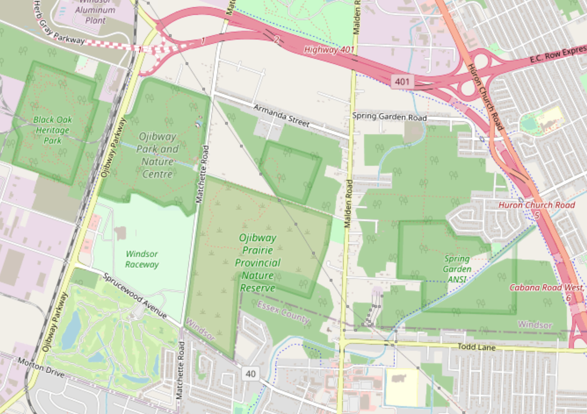
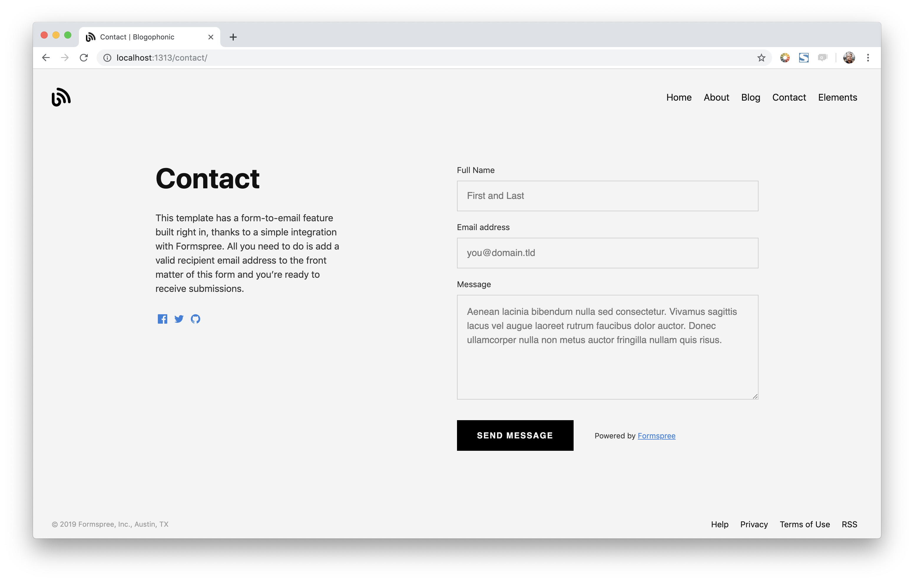

<div style="text-align: center;">

</div>

<style type="text/css">
#Dred { font-weight: bold; color: rgb(175, 0, 0); }
#Gold { font-weight: bold; color: rgb(230, 190, 0); }
#Gr2 { font-weight: bold; color: rgb(25, 200, 25); }
#Fgr { font-weight: bold; color: rgb(20, 80, 20); }
#Blue { font-weight: bold; color: blue; }
#Db2 { font-weight: bold; color: rgb(0, 0, 100); }
#V { font-weight: bold; color: rgb(180, 73, 255); }
#Purple { font-weight: bold; color: rgb(150, 0, 255); }
#Dpurp { font-weight: bold; color: rgb(95, 0, 161); }
#Magenta { font-weight: bold; color: rgb(255, 0, 255); }
#Coral { font-weight: bold; color: rgb(255, 127, 80); }
#Crim { font-weight: bold; color: rgb(220, 20, 60); }
#Rasp { font-weight: bold; color: rgb(227, 11, 92); }
#Lgray { font-weight: bold; color: rgb(190, 190, 190); }
#Gray { font-weight: bold; color: rgb(155, 155, 155); }
#Dgray { font-weight: bold; color: rgb(95, 95, 95); }
#Brown { font-weight: bold; color: rgb(165, 42, 42); }
#Rust { font-weight: bold; color: rgb(183, 65, 14); }
#Dbr { font-weight: bold; color: rgb(100, 20, 20); }
</style>

<!-- this is a subheadline -->
&nbsp; &nbsp; <span id="Dred">O</span>jibway <span id="Dred">P</span>rairie <span id="Dred">C</span>omplex (<span id="Dred">OPC</span>) in Essex county was once home to the town of Ojibway, which was annexed by the city of Windsor in 1966. The ~350 hectares (ha) <span id="Dred">OPC</span> are divided between five distinct parcels of land, including **Ojibway Park** (~61.5 ha), **Ojibway Prairie Provincial Nature Reserve** (105 ha), **Tallgrass Prairie Heritage Park** (~15.6 ha), **Spring Garden ANSI** (~117 ha), and the **Black Oak Heritage Park** (~50.6 ha). Collectively they are home to more than 160 species of provincially rare plants and animals, more than any other site in Ontario. Arguably it is one of Canada's most treasured natural areas.  
&nbsp; &nbsp; Unfortunately, <span id="Dred">OPC</span> is one of only three major remnants of **[Tallgrass Community](https://tallgrassontario.org/wp-site/)** remaining in the province. The other two major **Tallgrass Communities** are found at **W**alpole **I**sland **F**irst **N**ations (<span id="Blue">WIFN</span>, ~850 ha) and **P**inery **P**rovincial **P**ark (<span id="Blue">PPP</span>, ~1250 ha). Together these three areas are thought to account for ~90% of the province’s existing Tallgrass Communities. Historically, the southern part of the province was estimated to contain upwards of 200,000 ha (2,000 km&#178;) of Tallgrass Communities.  
&nbsp; &nbsp; According to Ontario's ecological land classification systems, <span id="Dred">OPC</span> is part of the southern most <span id="Gr2">ecoregion</span> (i.e. **7E: [Southern Great Lakes lowland forests](https://www.ontario.ca/page/ecosystems-ontario-part-1-ecozones-and-ecoregions)**) of Ontario's **Mixedwood Plains** <span id="Gr2">ecozone</span>. 


&nbsp; &nbsp; Geologically the landscape of <span id="Dred">OPC</span> was largely sculpted by glacial ice and water. The unconsolidated material lying atop the bedrock at <span id="Dred">OPC</span> was laid down during the latter part of the [Wisconsin glacial period](https://opentextbc.ca/geology/chapter/16-1-glacial-periods-in-earths-history/) (c. ~75,000 to 10,000 years ago). These layers of ice-age sediment are part of a much larger glacial feature known as the **St. Clair Clay Plain**. The silty-clay content of this plain extends beyond the borders of Essex county into neighbouring Kent and Lambton counties.

**(ii) CLIMATE:** is relatively mild due in large part to the modifying affect of the Great Lakes. 

**(iii) BIODIVERSITY:** 

# References:


<!-- This theme has a **form-to-email** feature built in, thanks to the simple Formspree integration. All you need to activate the form is a valid recipient email address saved in the front matter of the form (`/content/forms/contact.md`). Of course, the example shown below (`your@email.here`) must not be used. Please use your actual email address.

```toml
# please replace with a valid Formspree form id or email address
formspree_form_id: your@email.here
```

Update that file and you're ready to begin receiving submissions. Just submit the active form for the first time, and complete the email address verification step with Formspree, and your contact form is live. The next time someone fills it out, the submission will land in your inbox.

### Multiple Layouts

The files included with the theme have a contact page ready for copy/paste, or you can type `hugo new forms/contact.md` and you're off to the races. There are two layouts for `forms` – `split-right`, and `split-left` – you guessed it, one puts the form on the right and the other on the left. You just fill out the front matter, and the rest is automatic.

```toml
# layout options: split-right or split-left
layout: split-right
```



Both layouts display the page title and description opposite the form, and you can also choose to show your social icon links if you have those configured in the `config.toml` file.

-->


